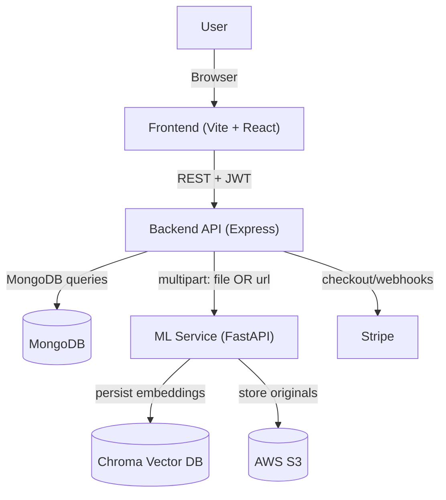
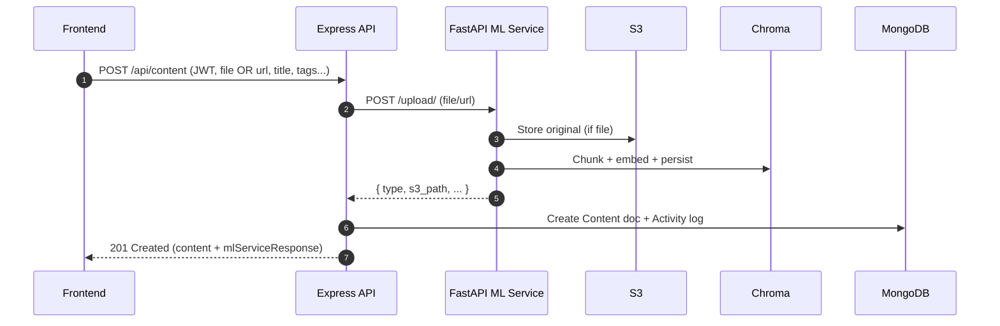
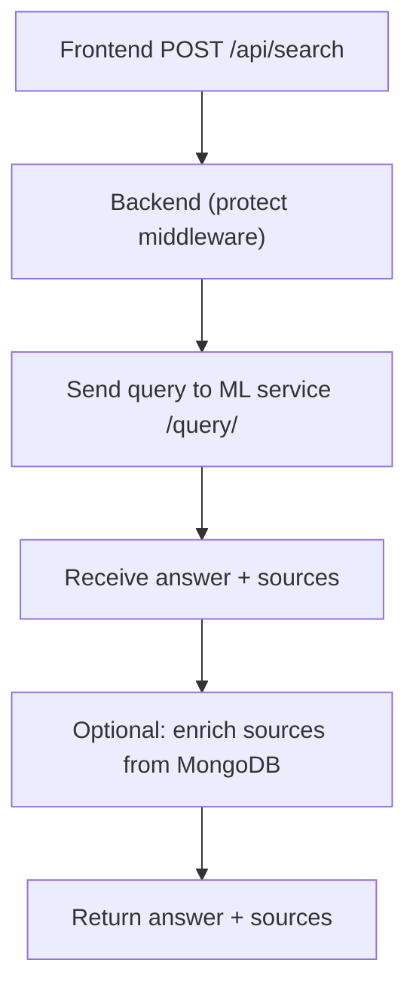

# Second Brain — Backend

The Second Brain backend is a Node.js/Express API that handles authentication, content management (upload/update/share), user activity/stats, and billing (Stripe). For content ingestion and AI-powered search, it forwards uploads/URLs and queries to a Python FastAPI “ML service” that performs RAG-style indexing and retrieval.

---

## Architecture (high-level)



> Mermaid preview: GitHub will render the diagram automatically.

---

## Key modules

- **Express server & routing**: request handling, CORS, JSON parsing, route mounting.
- **Auth**: email/password JWT auth + Google/GitHub OAuth (Passport).
- **Content**: CRUD, sharing, and upload forwarding to ML service.
- **Search**: query → ML service → (optional) enrich sources with MongoDB metadata.
- **User**: profile, recent activity feed, usage stats.
- **Billing**: Stripe checkout sessions, customer portal, webhook processing.

---

## Features (backend)

- JWT-protected REST endpoints
- Google + GitHub OAuth using Passport strategies
- Content ingestion via **file upload** or **URL ingestion** (forwarded to ML service)
- AI search endpoint that returns **answer + sources** (from ML service)
- Activity logging (add/edit/delete/share)
- Stripe subscriptions: checkout, billing portal, webhooks

---

## Request flow (typical)

### Upload + index content



### Search



---

## Getting started (quick glance)

### 1) Install

```bash
cd Backend
npm install
```

### 2) Environment variables

Create `Backend/.env`:

```ini
# Server
PORT=5001
CLIENT_URL=http://localhost:8080

# Database
MONGO_URI=mongodb://localhost:27017/second_brain_db

# Auth
JWT_SECRET=your_super_secret_jwt_key
GOOGLE_CLIENT_ID=
GOOGLE_CLIENT_SECRET=
GITHUB_CLIENT_ID=
GITHUB_CLIENT_SECRET=

# ML service
ML_API_URL=http://localhost:8000

# Stripe
STRIPE_SECRET_KEY=
STRIPE_WEBHOOK_SECRET=
STRIPE_PREMIUM_PLAN_ID=
STRIPE_PRO_PLAN_ID=
```

### 3) Run

```bash
npm run dev
# server on http://localhost:5001 (by default)
```

> Note: The Stripe webhook endpoint uses a raw body handler (mounted in `server.js`) so Stripe signatures can be verified.
