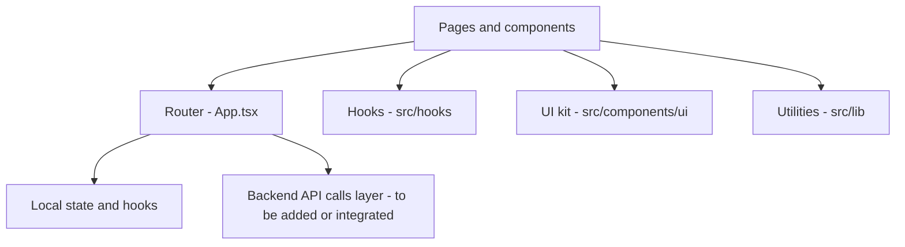

# Frontend files and structure

This document describes the purpose of each file and directory in `Frontend/` at a high level.

---

## Top-level files

### `Frontend/index.html`
Entry HTML for the SPA. Contains `

` where React mounts, plus metadata for SEO and social previews.

### `Frontend/package.json`
Frontend dependencies and scripts:
- `dev`: run Vite dev server
- `build`: build production assets
- `preview`: preview production build locally
Also defines key dependencies like React, React Router, TanStack Query, Radix UI, Tailwind utilities, etc.

### `Frontend/vite.config.ts`
Vite configuration:
- Dev server: host `::`, port `8080`
- Plugins: React SWC plugin; `lovable-tagger` enabled in development
- Alias: `@` maps to `Frontend/src`

---

## `Frontend/src` directory

### `Frontend/src/main.tsx`
Application entry point. Creates the React root and mounts the app.
Wraps the app in a theme provider.

### `Frontend/src/App.tsx`
Main application component and router definition.
Defines routes:
- `/` -> Landing
- `/login` -> Login
- `/signup` -> Signup
- `/dashboard` -> Dashboard
- `/settings` -> Settings
- `/pricing` -> Pricing
- `*` -> NotFound

Also sets up shared providers:
- Tooltip provider
- Toast providers
- React Query client provider

### `Frontend/src/index.css`
Global CSS and Tailwind layer setup.
Defines base styling and utility classes used across the app.

---

## `Frontend/src/pages` directory

### `Frontend/src/pages/Landing.tsx`
Marketing landing page.
Provides navigation links into signup, login, and pricing.
Highlights product value and features.

### `Frontend/src/pages/Login.tsx`
Login screen UI.
Currently shows toast feedback indicating authentication requires a hosted service or additional setup.

### `Frontend/src/pages/Signup.tsx`
Signup screen UI.
Validates password confirmation and shows toast feedback.

### `Frontend/src/pages/Dashboard.tsx`
Primary application screen.
Responsible for displaying content items, filtering by tags, and opening dialogs for add or edit actions.
Also includes header actions and theme toggle.

### `Frontend/src/pages/Settings.tsx`
Settings screen UI.
Used for user preferences and app configuration surfaces.

### `Frontend/src/pages/Pricing.tsx`
Pricing and upgrade screen UI.
Displays tier options and plan features.

### `Frontend/src/pages/NotFound.tsx`
Fallback page for unknown routes.

---

## `Frontend/src/components` directory

### `Frontend/src/components/AddContentDialog.tsx`
Modal or dialog UI for adding new content.
Typically collects metadata like title, description, tags, and either a file or a URL.

### `Frontend/src/components/EditContentDialog.tsx`
Modal or dialog UI for editing existing content metadata.

### `Frontend/src/components/ui`
Reusable UI components, commonly sourced from a UI kit approach.
This folder typically includes buttons, inputs, dialogs, cards, tabs, etc.
Note: the exact file list may be long and can change. Treat this directory as the design system layer.

---

## `Frontend/src/hooks` directory

### `Frontend/src/hooks/use-mobile.tsx`
Hook used to detect mobile breakpoints and adapt UI behaviors.

### `Frontend/src/hooks/use-toast.ts`
Hook utilities for showing toast notifications and managing toast state.

---

## `Frontend/src/lib` directory

### `Frontend/src/lib/utils.ts`
Utility helpers. Includes `cn(...)` to merge Tailwind class names safely.

---

## Optional architecture view

---

## Notes for extension

If you plan to connect real backend auth and content APIs, consider adding:
- `src/services/api.ts` for Axios or fetch wrappers
- `src/services/auth.ts` and `src/services/content.ts`
- `src/types/*` for shared types
- `src/config/*` for environment-based configuration
