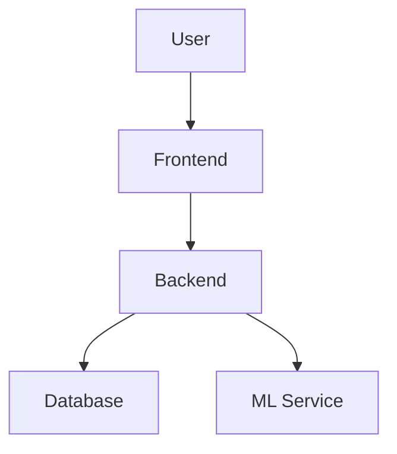
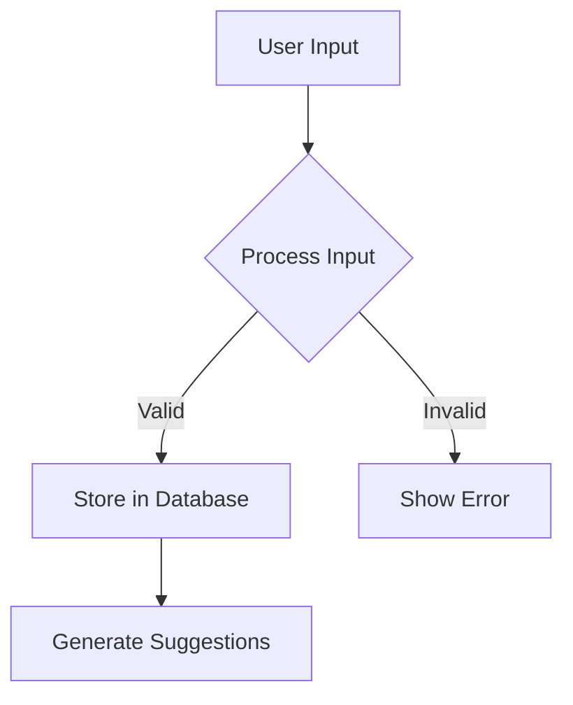

# Second Brain

## Project Overview
Second Brain is a productivity tool designed to help users organize and manage their personal knowledge base efficiently. The project integrates various machine learning services to provide intelligent suggestions and insights based on user input.

## Architecture Diagram

## Features
- Intuitive user interface for easy navigation
- Integration with machine learning services for personalized suggestions
- Robust backend to support scalability
- Comprehensive documentation for users and developers

## Activity/Flow Diagram

## Getting Started
1. Clone the repository using `git clone <repository_url>`.
2. Install dependencies by running `npm install` for the frontend and `pip install -r requirements.txt` for the backend.
3. Set up environment variables as documented in `Backend/config/CONFIG.md`.
4. Run the application on your local machine.
