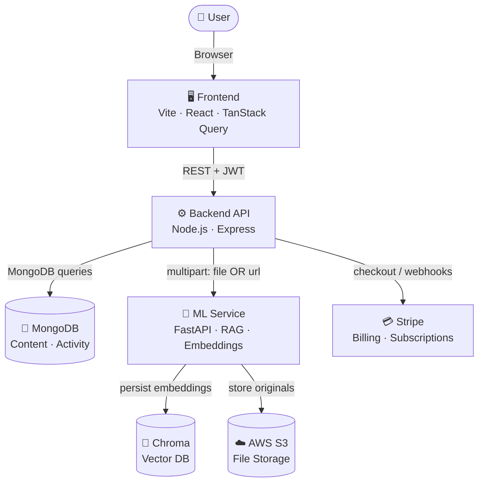
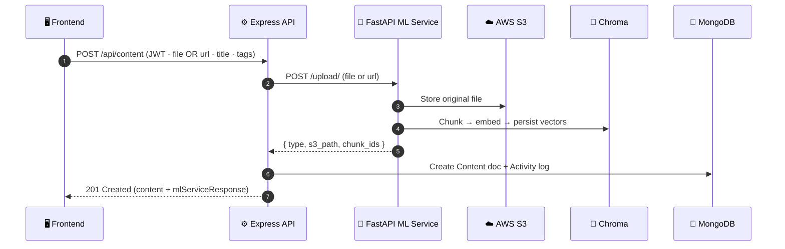
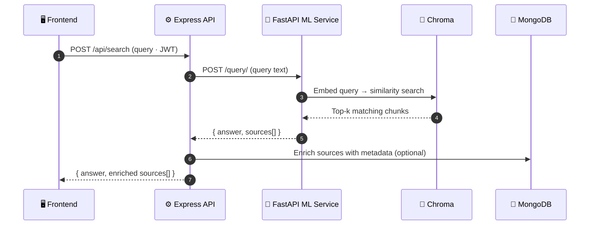
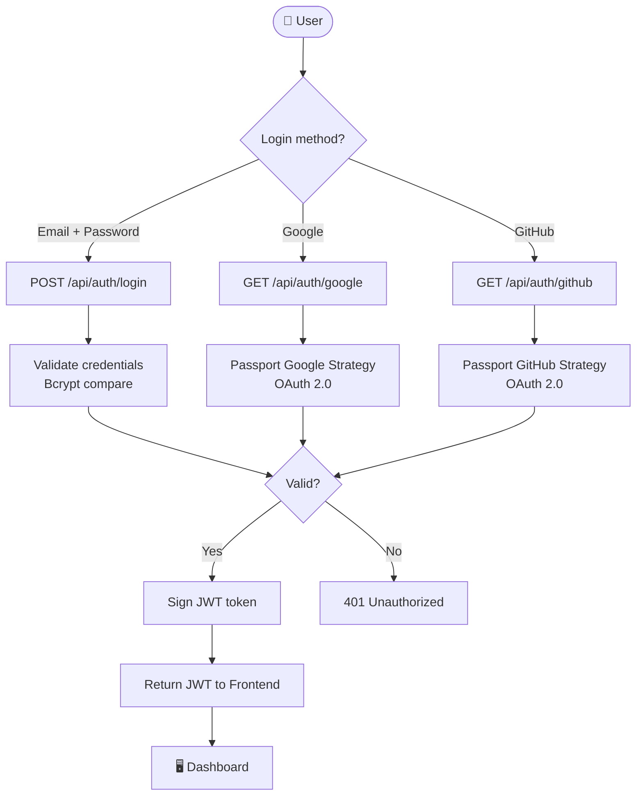
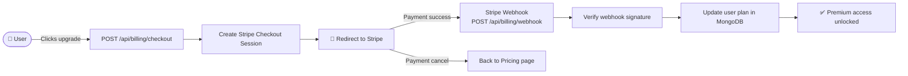

# 🧠 Second Brain

> Your AI-powered personal knowledge engine — capture, organise, search, and surface anything.


---

## 📖 About

Second Brain is a full-stack, AI-powered knowledge management platform that lets you save, tag, and semantically search any piece of content — web pages, documents, notes, or files. The system pairs a slick React SPA with a Node.js/Express backend and a Python FastAPI ML service for RAG-style (Retrieval-Augmented Generation) indexing and retrieval.

Content is chunked, embedded, and stored in a **Chroma vector database**, making every upload instantly searchable via natural-language queries. Stripe handles subscription billing, Google/GitHub OAuth handles authentication, and AWS S3 stores original files — everything you'd expect from a production-grade SaaS knowledge tool.

---

## ✨ Features

- 🔍 **AI-powered semantic search** — Natural-language queries return an AI-generated answer with ranked source citations via RAG.
- 📥 **File & URL ingestion** — Upload documents or paste a URL; both are chunked, embedded, and indexed automatically via the ML service.
- 🔐 **Auth & OAuth** — Email/password login plus Google and GitHub OAuth via Passport.js, all secured with JWT tokens.
- 🏷️ **Tagging & filtering** — Organise content with custom tags and filter your dashboard to find items instantly.
- 📊 **Activity & usage stats** — Track add, edit, delete, and share events with a user-facing activity feed and usage metrics.
- 💳 **Stripe billing** — Full subscription management: checkout sessions, customer billing portal, and webhook handling.
- 🌗 **Theme toggle** — Light/dark mode support built into the frontend dashboard.
- 🔗 **Content sharing** — Share individual content items with others via the content management layer.

---

## 🏗️ Architecture

### High-level system overview



---

### 🔀 Request flow — upload & index content



---

### 🔍 Request flow — AI search



---

### 🔐 Auth flow — login & OAuth



---

### 💳 Billing flow — Stripe subscription



---

## 📁 Project structure

```
/
├── Frontend/                  # Vite + React SPA
│   ├── src/
│   │   ├── pages/             # Landing, Login, Signup, Dashboard, Settings, Pricing
│   │   ├── components/        # AddContentDialog, EditContentDialog, UI kit
│   │   ├── hooks/             # use-mobile, use-toast
│   │   └── lib/               # Utility helpers (cn, etc.)
│   ├── index.html
│   ├── vite.config.ts
│   └── README.md              # ← Frontend setup guide
│
├── Backend/                   # Node.js / Express API
│   ├── routes/                # Auth, Content, Search, User, Billing
│   ├── models/                # MongoDB schemas
│   ├── middleware/            # JWT protect, raw body for Stripe
│   ├── server.js
│   └── README.md              # ← Backend setup guide
│
└── README.md                  # ← You are here
```

> 📘 Each sub-directory has its own detailed README — see [Frontend/README.md](./Frontend/README.md) and [Backend/README.md](./Backend/README.md) for full setup instructions.

---

## 🚀 Getting started

### Prerequisites

- Node.js 18+
- Python 3.10+ (for the ML service)
- MongoDB (local or Atlas)
- AWS S3 bucket
- Stripe account

### 1. Clone the repo

```bash
git clone https://github.com/your-username/second-brain.git
cd second-brain
```

### 2. Start the Frontend

```bash
cd Frontend
npm install
npm run dev
# → http://localhost:8080
```

### 3. Start the Backend

```bash
cd Backend
npm install
npm run dev
# → http://localhost:5001
```

### 4. Environment variables (Backend)

Create a `Backend/.env` file:

```ini
# Server
PORT=5001
CLIENT_URL=http://localhost:8080

# Database
MONGO_URI=mongodb://localhost:27017/second_brain_db

# Auth
JWT_SECRET=your_super_secret_jwt_key
GOOGLE_CLIENT_ID=
GOOGLE_CLIENT_SECRET=
GITHUB_CLIENT_ID=
GITHUB_CLIENT_SECRET=

# ML Service
ML_API_URL=http://localhost:8000

# Stripe
STRIPE_SECRET_KEY=
STRIPE_WEBHOOK_SECRET=
STRIPE_PREMIUM_PLAN_ID=
STRIPE_PRO_PLAN_ID=
```

> ⚠️ The Stripe webhook endpoint requires a raw body handler for signature verification — this is already configured in `server.js`.

---

## 🧰 Tech stack

| Layer | Technology |
|---|---|
| Frontend | React 18, Vite, React Router, Radix UI, Tailwind CSS |
| Backend | Node.js, Express, Passport.js (Google + GitHub OAuth), JWT |
| ML Service | Python, FastAPI, LangChain / embeddings, Chroma vector DB |
| Database | MongoDB (metadata + activity), Chroma (vector embeddings) |
| Storage | AWS S3 (original files) |
| Billing | Stripe (subscriptions, portal, webhooks) |

---

